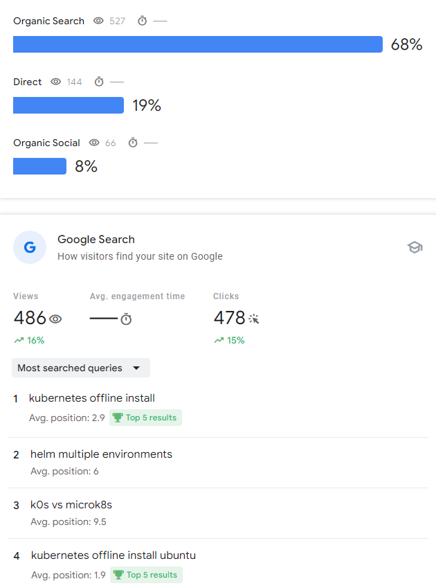
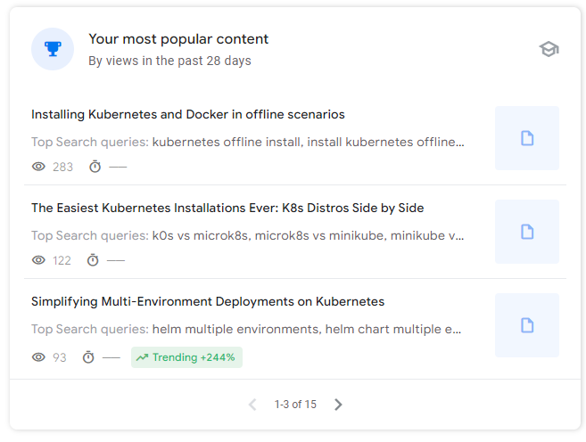

I'm excited to share some great news with you all; my blog has made it to the top 3 for **[Kubernetes in airgap environments](https://rebelion.la/install-kubernetes-docker-offline)**. For those unfamiliar, airgap environments are places where there's no direct access to the internet or public registries. This poses unique challenges, especially when deploying and managing Kubernetes clusters. Seeing my work recognized for such a critical subject is incredibly rewarding, but I'm not stopping here. I'm aiming for the **top spot**! 🎯

<!-- truncate -->

## A Big Thanks to the "La Rebelion" Community

I couldn't have done it without you; my community at "[La Rebelion](https://rebelion.la)". Your feedback, support, and insights have been invaluable. Each challenge and question you've shared with me has shaped the content, helping us all navigate the tough waters of airgap environments. It's all about learning together and building better solutions.

### Popular Topics in Kubernetes Airgap Environments

Here are some of the most popular topics we've covered:

- [Installing Kubernetes and Docker Offline](https://rebelion.la/install-kubernetes-docker-offline)
- [The Easieast Kubernetes Installations Ever](https://rebelion.la/the-easiest-kubernetes-installations-ever) for diffetent Kubernetes distros.
- [How to install Kubernetes in airgapped environments without a container runtime](https://rebelion.la/how-to-install-kubernetes-in-airgapped-environments-without-a-container-runtime)

## Let's Talk About Your Challenges

As I continue to improve the content and tools, I want to hear from you. Are you facing issues with **Kubernetes in airgap environments**? Or perhaps struggling with **API management** and integration? If so, I'm eager to help. I'm developing solutions through my tools at [K1s](https://k1s.sh) and [APICove](https://apicove.com) to address the specific pain points engineers and product managers deal with.

Here's where you come in: let me know what's getting in your way. Whether it's managing dependencies, handling upgrades, or creating resilient pipelines in environments with no internet, I want to know. Your challenges fuel the creation of better tools that will make your job easier.

## Tools to Watch: K1s and Skope Quest

You're likely already familiar with [K1s](https://k1s.sh), which simplifies workflows for **Kubernetes airgap environments**. But I'm also working on a new tool; [Skope Quest](https://skope.quest); designed to help manage product backlogs, particularly for **software engineers** and **technical product managers**. Think of it as a productivity booster tailored for the challenges we face in cloud-native and DevOps environments.

The journey doesn't stop at Kubernetes or APIs. Tools like **Skope Quest** will soon allow you to **manage your projects more efficiently**, whether you're working with code or leading a team through complex technical decisions. Stay tuned for its release!

These all are solutions to problems I've faced myself, and I'm excited to share them with you. I have to disclose that they're still in the early stages, and even though some are already helping many, others are still in product discovery mode. But remember, your feedback is crucial to making these tools as effective as possible.

## Let's Work Together to Make It to #1

It's clear that Kubernetes in airgap environments is a space full of challenges and innovation. By working together, we can build a community that not only solves today's problems but also shapes the future of how we work in restricted environments. I'm committed to developing more content and tools that **make your life easier**, and I need your feedback to get there.

So, let's keep the conversation going. What are you dealing with right now? How can I help you tackle the roadblocks you're facing with **Kubernetes** or **API management**? Let's team up, solve these problems together, and get to that number one spot!

---

**Thank you again** for the support, and stay tuned for more updates. Don't hesitate to [connect with me](https://https://www.linkedin.com/comm/mynetwork/discovery-see-all?usecase=PEOPLE_FOLLOWS&followMember=adrianescutia), whether you want to collaborate, share your challenges, or simply [say hi](https://go.rebelion.la/contact-us). 

Let's break those airgaps down, one challenge at a time. Go Rebels! ✊🏻

**– Adrian**  
**Founder, La Rebelion**  

