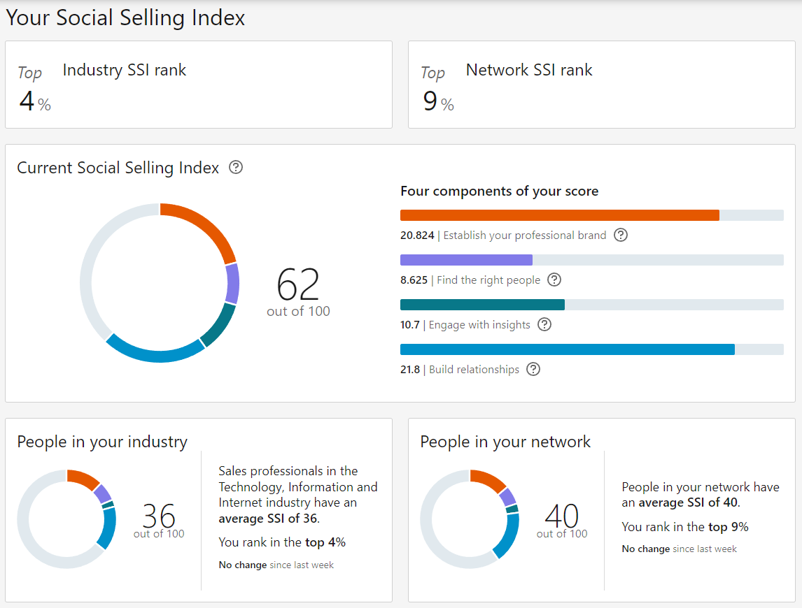

## Setting Bold Goals for 2025: My Journey of Growth and Knowledge Sharing

I've never aimed to be the smartest person in the room. I'm not a genius by any means and I don't have all the answers, but I'm always driven to push boundaries and solve problems that excite me. Recently, my blog has reached the top 3 search results for Kubernetes in airgap environments; a big win for me, because it means people are finding value in what I'm sharing. But, of course, I'm aiming even higher for that number one spot!

<!-- truncate -->

On the LinkedIn front, I just discovered the **Social Selling Index (SSI)**, which feels a bit like the SEO world of LinkedIn. It's been eye-opening, and it's motivated me to set some ambitious goals for 2025. I'm aiming to boost my SSI by 2 points in Industry and 3 points in my Network. It's a challenge, but challenges are where growth happens.

What fuels me? Creating innovative solutions, solving complex problems, and sharing that knowledge with others. I believe in a cycle: create, grow, share, and then start all over again. It's about continuous improvement and lifting others up along the way.

While I don't consider myself a salesperson, I know that delivering real technical solutions speaks for itself. This journey isn't just about hitting numbers; it's about helping others grow and learning together, if I can build a community around that and my personal growth goals, then I'm on the right track. Let's see where 2025 takes us.

::: tip

I know it seems like to early to be thinking about 2025, but it's never too early to set goals and start working towards them.

:::

Go boldly, and help others along the way. Go Rebels! ✊🏻

To get the content and tools I'm sharing to help you grow and learn, follow me also on:

* "[La Rebelion](https://rebelion.la)" - All about Kubernetes, DevOps, and Cloud Native
* [Adrian Escutia](https://https://www.linkedin.com/comm/mynetwork/discovery-see-all?usecase=PEOPLE_FOLLOWS&followMember=adrianescutia) - This is my personal LinkedIn profile
* [APICove](https://apicove.com) - API-First Tools to Accelerate Your Development
* [K1s](https://k1s.sh) - Simpliying Kubernetes in airgap environments
