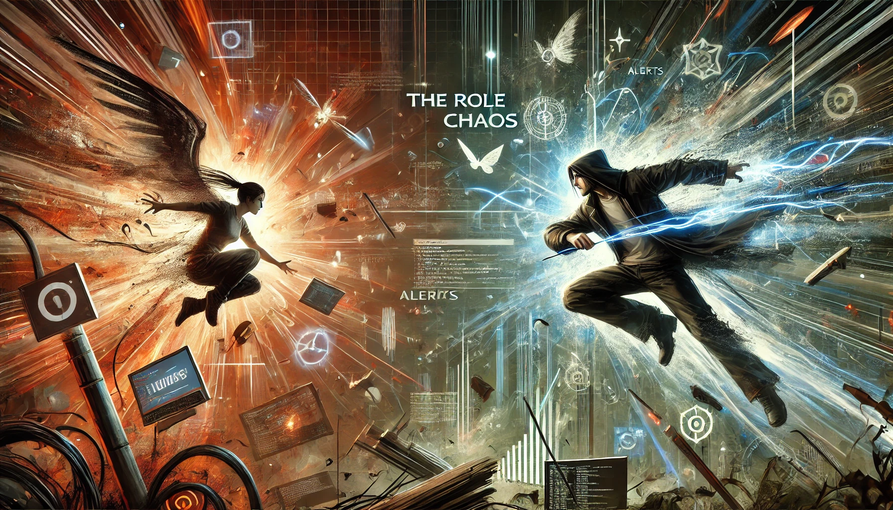

Not all developers solve problems the same way. Some build features that are "nice to have," while others address urgent, pressing issues. The difference? They're either a "**Vitamin Developer**" or a "**Painkiller Developer**."

In the startups world, [the term "painkiller"](https://www.forbes.com/sites/georgedeeb/2014/07/24/is-your-startup-building-a-vitamin-or-a-painkiller/) is often used to describe a product or service that solves a pressing problem for customers, it is expected to be a **must-have** in order to solve a pain point, while a "vitamin" is a product or service that is **nice to have**, but not essential, as an example, a painkiller would be a CRM system for a sales team, while a vitamin would be a team chat tool. It's something they need, not just something they want. Taking this analogy further, I think that in the tech world, the same concept applies to developers, but **we need both** types if we want to build a successful team less reactive and more proactive.

<!-- truncate -->

In every tech team, you'll find two types of developers. There are those who are **painkillers**; they fix urgent, high-priority issues, stopping the bleeding when systems go down or bugs impact customers. Then there are the **vitamin developers**; the ones who build long-term solutions that prevent these issues from happening in the first place. Both types are critical for the success of any team, but it's the **balance between the two** that creates a high-performing DevOps or IT organization.

This post dives deep into the **vitamin vs. painkiller** analogy, exploring how it applies to developers, DevOps engineers, and IT managers. We'll also cover how key cultural values like **failure tolerance, curiosity, chaos under control**, and a **willingness to learn** can transform your team into a powerhouse that not only solves today's problems but prevents tomorrow's disasters.

> The best outcomes happen when proactive and reactive approaches work hand-in-hand, each informing and strengthening the other.

## 1. The Vitamin Developer: Proactive Innovation

Vitamin developers are the **architects of long-term stability**. They focus on building solutions that make systems more robust, scalable, and easier to maintain. Their work doesn't always solve immediate, high-stakes problems. Instead, it acts as a **preventive measure**, ensuring those problems don't arise in the first place.

In the world of DevOps, vitamin developers are the ones setting up **automation**, optimizing CI/CD pipelines, and introducing tools and frameworks that allow your team to work faster and smarter. They might not always get the spotlight because their work isn't as visible as fixing an outage, but they're the unsung heroes **who prevent outages from happening at all.**

### The Value of Proactive Solutions

1. **System Resilience**: Vitamin developers build systems that can handle unexpected load spikes, recover from failures, and operate without constant oversight. 
2. **Automation**: They prioritize automating repetitive tasks, reducing the risk of human error and freeing up time for more strategic work.
3. **Preventive Monitoring**: These developers also set up monitoring and alerting systems, allowing teams to **detect potential issues** before they escalate into full-blown problems.
4. **Continuous Improvement**: Vitamin developers are always looking for ways to **improve**; whether it's through new tools, better processes, or optimizing existing workflows.
5. **Scalability**: They design systems that can grow with the business, ensuring that as your user base expands, your infrastructure can handle the load.
6. **Security**: Vitamin developers prioritize security measures, implementing best practices to protect systems from vulnerabilities and attacks.
7. **Technical Debt Reduction**: They work to pay down technical debt, refactoring codebases and optimizing systems to reduce the risk of future issues.
8. **Innovation**: Vitamin developers are often the ones driving innovation within a team, introducing new technologies and approaches that keep systems ahead of the curve.

---

## 2. The Painkiller Developer: Reactive Problem Solving

Painkiller developers are the **firefighters** of your team. When something goes wrong; whether it's an outage, security breach, or a critical bug; they're the ones who swoop in to fix things and get systems back online. Their work is **high-stakes and urgent**, and often comes with a lot of pressure.

But without painkiller developers, businesses would grind to a halt during incidents. They thrive in chaos, solving problems quickly and under pressure. Their ability to stay calm and think critically during a crisis is invaluable, especially in today's high-availability environments where downtime can cost a company millions.

### The Value of Reactive Solutions

1. **Incident Response**: Painkiller developers are the first responders in an outage or incident, quickly diagnosing and resolving the issue to minimize downtime.
2. **Crisis Management**: They work well under pressure and are skilled at **prioritizing tasks** in high-stress situations, focusing on the most critical problems.
3. **Root Cause Analysis**: Once the immediate issue is fixed, they're able to dive into the **root cause** to ensure it doesn't happen again.
4. **Knowledge of Legacy Systems**: These developers are often well-versed in **legacy systems** and infrastructure, allowing them to troubleshoot deeply embedded issues that others might overlook.
5. **On-Call Support**: Painkiller developers are often part of the on-call rotation, ready to respond to incidents at any time of day or night.
6. **Quick Fixes**: They're skilled at applying **temporary fixes** that restore normal operations, buying time for vitamin developers to implement long-term solutions.
7. **Adaptability**: Painkiller developers are adaptable and can switch context quickly, moving from one problem to the next without missing a beat.
8. **Customer Focus**: They understand the impact of incidents on customers and are driven to **resolve issues** as quickly as possible to minimize disruption.

---

## 3. The Need for Balance: Why Both Are Critical

Here's the reality: **You need both types of developers.**

Painkiller developers are critical in any environment where uptime is a priority (which, let's face it, is every modern business). They keep things running smoothly by **responding to critical issues** in real time. But without vitamin developers, you'd be stuck in a never-ending cycle of reactive firefighting, never improving the systems or preventing future problems.

Vitamin developers, on the other hand, are your **long-term strategic thinkers**. They work to build systems that reduce the need for constant intervention. However, without painkillers, they'd lack the real-time insights that come from managing systems under stress.

It's the **balance between proactive and reactive work** that makes a tech team truly successful. Vitamin developers keep you ahead of the curve, while painkiller developers ensure you can respond when things don't go according to plan.

Where are you on the vitamin vs. painkiller spectrum? Are you more focused on building long-term solutions that prevent issues, or are you the first to jump in when things go wrong? Recognizing your strengths and areas for growth can help you position yourself as a **well-rounded developer** who can tackle any challenge that comes your way.

---

## 4. Culture: The Backbone of High-Performing Teams

Building a strong team of vitamin and painkiller developers starts with the **right culture**. This isn't just about hiring the right people; it's about fostering an environment where both types of work are respected and encouraged. Here's how the key cultural values play a role:

### Failure Tolerance: A Key to Growth

In a culture that values **[failure tolerance](https://hbr.org/2002/08/the-failure-tolerant-leader)**, developers feel safe to take risks. Vitamin developers need this when they're experimenting with new tools, frameworks, or approaches that could **improve systems long-term**. Painkiller developers need it when they're making fast decisions in the heat of an incident, where not every fix is perfect.

- **Failure is Part of the Process**: Teams that allow failure create a **learning environment** where both types of developers can grow. Encourage experimentation and learning from mistakes. With a colleague in my job, we have our private team name: "Monkeys with hammer crew," because we are always trying new things and sometimes we break things. But that's how we learn. Even Monkeys fall from trees, right? 🔨🐒🌳

### Curiosity: Driving Continuous Improvement

**Curiosity** fuels both types of work. Vitamin developers are constantly asking, *"How can we make this better?"* Painkiller developers ask, *"What caused this problem?"* and generate hypotheses to test. By fostering curiosity, you empower your team to not only solve problems but also to **prevent them in the future**.

- **Encourage Exploration**: Teams should have the time and resources to **explore new ideas**. Whether it's testing out new DevOps tools or running experiments with chaos engineering, curiosity leads to innovation.

### Chaos Under Control: A Crucial Balance

Chaos is inevitable in IT, but the best teams know how to keep it **under control**. Painkiller developers are often the ones managing chaos in real-time, but vitamin developers are the ones who create **structures and processes** to keep that chaos at bay in the future.

- **Embrace Controlled Chaos**: Controlled chaos is a powerful driver of innovation. By encouraging teams to **experiment and iterate** even during high-stakes moments, you create resilience.

### Willingness to Learn: Adapting to an Evolving Landscape

Tech evolves quickly. Whether you're a painkiller or vitamin developer, you need to have a **willingness to learn**. Painkiller developers need to stay up to date on the latest **incident response techniques** and tools, while vitamin developers need to be constantly learning about **new methods for improving systems**.

- **Create a Learning Culture**: Encourage your team to continuously learn. Whether it's through formal training, side projects, or internal knowledge sharing, the more your team knows, the better equipped they'll be to handle future challenges.

---

## 5. The Role of Chaos (Under Control)

In DevOps, chaos is a given. Systems break, outages happen, and unexpected events throw even the best teams into disarray. However, how your team **handles that chaos** determines its success. Painkiller developers thrive in these situations, quickly diagnosing and resolving issues to restore order.

But here's the key: chaos can be **harnessed**. [Chaos engineering](https://www.gremlin.com/community/tutorials/chaos-engineering-the-history-principles-and-practice); intentionally introducing failures to test system resilience; is one way vitamin developers bring **order to chaos**. By experimenting with controlled chaos, they can **prevent future issues** and make systems more robust.

- **Painkiller's Role in Chaos**: They resolve chaos in real-time, applying quick fixes that restore normalcy.
- **Vitamin's Role in Chaos**: They study that chaos to understand its root cause and implement changes that make future disruptions less likely.

By embracing chaos under control, your team can turn what might seem like a disaster into an opportunity for growth and improvement. Chaos becomes a tool for learning, a way to test systems, and a path to resilience. Talking about tools, the [CNCF Chaos Engineering landscape](https://landscape.cncf.io/?group=projects-and-products&view-mode=grid&category=Observability+and+Analysis) is a great place to start if you want to learn more about the tools available. Breaking things on purpose is a great way to learn how to fix them when they break on their own, and doing so in a controlled environment is the best way to learn.

---

## 6. Willingness to Learn and Experiment: A Non-Negotiable Trait

> Continous learning and experimentation are key traits that drive innovation and growth.

In an industry where **technology evolves constantly**, a **willingness to learn** is non-negotiable. Developers must continually update their knowledge, whether they're tackling incidents in production or working on long-term improvements. Curiosity and experimentation are key traits that drive innovation and growth.

- **Experimentation is Key for Vitamin Developers**: Innovation doesn't happen without experimentation. Encourage your vitamin developers to try new tools and approaches, even if they don't always work. This willingness to experiment leads to breakthroughs that make systems stronger in the long run.

- **Painkiller Developers Learn in the Heat of the Moment**: On the flip side, painkiller developers often learn through **on-the-job experiences**, especially when solving time-critical issues. Their real-time problem-solving often leads to insights that can be applied to future projects.

By fostering a culture of learning and experimentation, you create a team that's **adaptable, resilient, and always improving**. Whether it's through formal training, side projects, or internal knowledge sharing, the more your team knows, the better equipped they'll be to handle future challenges.

---

## 7. Continuous Improvement: The Path to Success

Both vitamin and painkiller developers need to focus on **continuous improvement**. Whether it's by reducing the frequency of incidents or optimizing processes for faster deployments, both types of developers contribute to a cycle of **iteration and improvement**.

### For Painkiller Developers:
- **Learning from Failures**: After every incident, conduct a **post-mortem analysis** to identify what went wrong and how to prevent it next time. This process should feed directly into your vitamin developers' work to improve systems; is a cycle of learning and improvement that benefits the entire team.
- **Automating Incident Response**: Look for opportunities to automate repetitive incident response tasks. By creating playbooks and runbooks, you can streamline your response process and reduce the time it takes to resolve issues.

Tools you can use for this are [PagerDuty Runbook](https://www.pagerduty.com/platform/automation/runbook/), [Splunk](https://www.splunk.com/en_us/resources.html), [OpsGenie](https://www.ops genie.com/), [Squadcast Runbooks](https://www.squadcast.com/product/runbooks), and [xMatters](https://www.xmatters.com/features/incident-response).

### For Vitamin Developers:
- **Building Resilience**: Continuous improvement is essential to building more resilient systems. This involves refining processes, improving automation, and reducing the number of incidents over time. Regularly iterating on infrastructure, codebases, and workflows ensures that systems become more scalable and fault-tolerant.
- **Feedback Loops**: Implement feedback loops between painkiller and vitamin developers. Painkiller developers can share insights from incidents, helping vitamin developers better understand the weaknesses in current systems. This collaboration creates a **cycle of learning and improvement** that benefits the entire team.

Tools that vitamin developers can use are [Chaos Monkey](https://netflix.github.io/chaosmonkey/) from Netflix, [Gremlin](https://www.gremlin.com/), [Chaos Mesh](https://chaos-mesh.org/), and [Chaos Toolkit](https://chaostoolkit.org/). These tools allow you to simulate real-world failures in a controlled environment, helping you identify weaknesses and strengthen your systems to prevent incidents in production.

By focusing on continuous improvement, your team can create a culture of **learning, growth, and innovation**. Whether it's through post-incident reviews, automation, or feedback loops, the more your team invests in improvement, the stronger your systems will become.

## 8. Building a Culture That Supports Both Types of Developers

To truly balance the work of vitamin and painkiller developers, your team culture needs to support both **proactive** and **reactive** mindsets. This starts at the leadership level. Leaders must ensure that both types of work are **valued equally** and that team members feel empowered to contribute in different ways.

### Encourage Collaboration
One of the most effective ways to balance vitamin and painkiller developers is through collaboration. Regularly bring the two groups together to share insights, learn from each other, and **cross-pollinate ideas**. Painkiller developers often have deep knowledge of real-world system behavior, which is invaluable for vitamin developers who are building preventive solutions.

### Prioritize Knowledge Sharing
Knowledge sharing is key to creating a well-rounded team. Ensure that your painkiller developers share post-incident reports and lessons learned, and that your vitamin developers document and communicate system improvements. Create a culture where **knowledge flows freely**, so the team can grow together.

### Create Dedicated Time for Proactive Work
A common pitfall in many organizations is that reactive work tends to dominate the schedule. When firefighting takes over, vitamin developers may not get the time they need to focus on long-term improvements. To combat this, it's crucial to **carve out dedicated time** for proactive work. Whether it's through dedicated sprints or designated improvement days, creating space for vitamin work ensures your team isn't stuck in reactive mode forever.

> Technical debt is a common challenge for many teams, but it can be managed effectively with the right approach.

Take a look at my blog post about the [technical debt quadrant model](https://rebelion.la/technical-debt-quadrant-model/), to learn more about how to manage technical debt and pay it down effectively.

### Celebrate Small Wins
Both painkiller and vitamin work can feel like a thankless job at times. Painkiller developers may feel the burnout of constant firefighting, while vitamin developers may get frustrated when their preventive work goes unnoticed. **Celebrate small wins** for both sides of the team. Recognize the quick fixes that resolve incidents, and also highlight the improvements that reduce incidents over time. 

## 9. Embracing a Growth Mindset for Developers and Managers

Both developers and managers need to embrace a **growth mindset** to support the balance of vitamin and painkiller work. This means being open to learning from mistakes, staying curious about new technologies, and being willing to experiment. A growth mindset fosters **continuous improvement**, allowing teams to evolve and adapt to changing business needs and technological landscapes.

### For Managers
- **Enable Learning Opportunities**: Encourage your team to attend workshops, conferences, or online courses. Providing time and resources for learning keeps your team **up-to-date** with the latest industry trends and helps vitamin developers stay ahead of potential issues before they arise.

- **Be a Role Model**: Demonstrate the importance of both reactive and proactive approaches in your own leadership. Show your team that you value long-term innovation just as much as immediate problem-solving. **Lead by example** by promoting a culture of learning, resilience, and balance.

### For Developers
- **Curiosity as a Core Value**: Cultivate a **curiosity-driven approach** to your work. For vitamin developers, this means constantly looking for ways to optimize and improve systems. For painkiller developers, curiosity means diving deep into incidents and asking *"why"* to understand the root cause of problems.

- **Adapt to Chaos**: Chaos is inevitable in IT, but how you respond to it matters. Painkiller developers need to **stay calm under pressure**, while vitamin developers should embrace chaos as a tool for learning. Through chaos engineering, they can simulate real-world failures to strengthen systems and prevent incidents.

## The Power of Balance

At the core of any successful DevOps or IT team is a **balance** between vitamin and painkiller developers. By building a culture that supports both proactive innovation and reactive problem-solving, you create an environment where your team can **thrive**. Painkiller developers will ensure your systems remain stable in the face of crises, while vitamin developers will build the resilience to prevent future incidents.

The most effective teams don't just react to problems; they anticipate them and continuously improve to avoid them altogether. By fostering a culture that values **failure tolerance, curiosity, chaos under control**, and a **willingness to learn**, you set your team up for long-term success. Remember, the **best outcomes** happen when proactive and reactive approaches work hand-in-hand, each informing and strengthening the other.

The best developers are those who can **embrace both mindsets**, but being realistic, what are the customers' needs and desires? They for sure don't want to have a system that is always down, but they also don't want to have a system that is always down because of the constant changes.

It's not about choosing between a **painkiller** or a **vitamin** mindset; it's about embracing both, and recognizing that **together**, they create a more resilient, innovative, and adaptable team.

What type of developer are you? How do you balance proactive and reactive work in your team? Share your thoughts in the comments below!

Go boldly, and help others along the way. Go Rebels! ✊🏻
