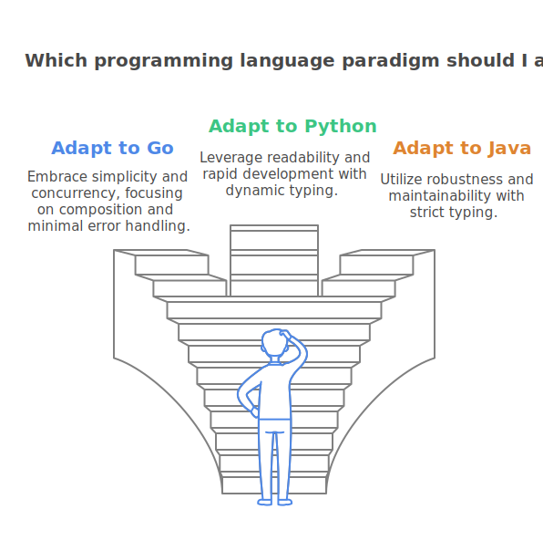
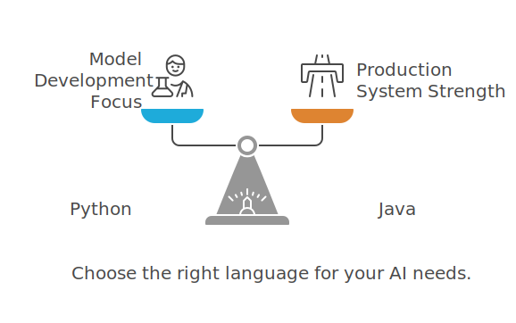

# "You Code Go Like You Code Java": The Perils of Multi-Language Development

## A Funny Yet Familiar Story

I was once in a technical interview with a senior Java developer who shared a hilarious yet painfully relatable experience. At his company, developers weren't confined to just one or two languages; they had to jump between different languages depending on the project. One day, after a code review, a senior Go developer told him:

> "*You code Go as if you were coding Java.*" 😅

Oof. That hit hard. But it's also a perfect illustration of why languages aren't interchangeable. <!-- truncate --> Different programming languages aren't just different syntactically; they embody unique paradigms, styles, and philosophies. What works in one may be an anti-pattern in another. Let's dive into why this happens and what it means for the future of Java in a world filled with AI, agents, and enterprise-grade systems.

## Why Not All Languages Are Created Equal

Every programming language is born with a purpose. Go was designed for simplicity and concurrency, Python for readability and rapid development, and Java for robustness and maintainability in enterprise environments. However, the problem arises when developers bring the habits of one language into another.

This is why learning a new language isn't just about understanding syntax; it's about adapting to a different way of thinking. Java developers moving to Go might struggle with Go's preference for composition over inheritance, its minimalistic error handling, and the lack of traditional OOP features. Similarly, a Python developer forced into Java might find themselves missing the ease of dynamic typing and concise syntax but will soon appreciate Java's strict typing and predictability in large systems.

## Python: Great for Beginners, But Not for Everything

Python is often hailed as one of the best languages for beginners; and for good reason:

✅ **Readability:** Its simple, English-like syntax lowers the barrier to entry.  
🪄 **Dynamic Typing:** No need to worry about variable declarations.  
📚 **Large Community & Libraries:** A wealth of resources available for everything from web development to AI.  

But here's the catch; Python is not the best language for everything. While its flexibility is a strength, it also leads to some issues:

🌀 **Messy Code & Maintainability:** Since Python allows multiple ways to solve the same problem, different developers may write wildly different code styles, making large projects harder to maintain, understand, and follow up.  
🦥 **Performance Concerns:** Python is interpreted and dynamically typed, so it is significantly slower than compiled languages like Java, Go, or C++.  
📈 **Scalability Issues:** Python's looseness can lead to unintentional bugs and performance bottlenecks in large-scale enterprise applications.  

Python has dominated AI and data science not because it's the best language for every application but because of its early adoption in these fields, its rich ecosystem of libraries (NumPy, [TensorFlow](https://www.tensorflow.org), [PyTorch](https://pytorch.org)), and the fact that AI workloads are largely [GPU-bound](https://opencv.org/blog/pytorch-vs-tensorflow/#h-key-features), making Python's CPU performance less of a concern.

## The Rise of AI Agents & Java's Role

With AI agents flooding the tech landscape, there's an opening for other languages to step in. Why? Because AI isn't just about training models; it's about integrating AI into existing enterprise systems, where Python isn't always the best fit.

Enter Java. Java has long been a workhorse in enterprise environments, and as AI moves beyond research labs and into production systems, Java's strengths shine:

⛑️ **Robustness & Maintainability:** Java's strict typing and structured design make it ideal for mission-critical applications.  
🦾 **Performance & Scalability:** Unlike Python, Java can handle high-load applications with better performance and lower memory overhead.  
📌 **Interoperability:** Java is deeply embedded in enterprise systems, making it easier to integrate AI-driven solutions without rewriting everything in Python.  

## MCP: A Game Changer for Java

One of the most significant developments for Java's future in AI is the MCP (Model Context Protocol, a protocol defined by Anthropic) initiative. Java is now evolving to be:

☁️ **More Cloud-Native:** Emphasizing lightweight, scalable applications. See [Quarkus](https://quarkus.io/guides/#categories=cloud) and [Spring](https://spring.io/projects/spring-cloud).  
🤹🏼‍♂️ **Better Suited for AI & Microservices:** As frameworks like [Spring AI](https://spring.io/projects/spring-ai) and [Jakarta EE](https://jakarta.ee) evolve, Java can support AI workloads and distributed architectures more efficiently.  
🧭 **A First-Class Citizen in AI & Enterprise Integration:** Java isn't just surviving; it's thriving in the modern AI era.  

Thanks to initiatives like MCP, [Quarkus MCP](https://github.com/quarkiverse/quarkus-mcp-server), [JBash](https://www.jbang.dev), and [Agentico](https://agentico.dev), Java is becoming a more attractive option for AI-driven applications, bridging the gap between AI models and enterprise systems.

## What Does This Mean for Java Developers?

Python has been considered the go-to language for AI for years, but as AI shifts from R&D to real-world applications, Java is poised to become indispensable. Enterprises need robust, secure, and scalable solutions, and Java offers precisely that.

**So, what's the takeaway?**

🧬 If you're a Java developer, embrace the evolving role of Java in AI and enterprise systems. Learn about MCP, Quarkus, and other AI tools to stay ahead of the curve.
🛟 If you're a polyglot developer, respect the paradigms of each language; don't write Go as if it were Java! 😜  
🗺️ If you're building AI-powered applications, consider the whole picture; Python is great for AI models, but Java might be the right choice for production systems and backend integrations (AI Tools).  

What do you think? Is Java poised for a new era in AI and enterprise? Or will Python continue to dominate the AI space? Let's discuss it!

Go Rebels! ✊🏻